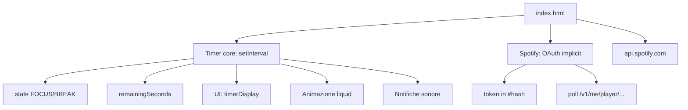

# FocusFlow: Timer Pomodoro

[](https://developer.mozilla.org/en-US/docs/Web/HTML)
[](https://developer.mozilla.org/en-US/docs/Web/CSS)
[](https://developer.mozilla.org/en-US/docs/Web/JavaScript)
[](https://developer.spotify.com/documentation/web-api)

FocusFlow è un timer Pomodoro pensato per sessioni di studio senza distrazioni. Oltre al timer con animazione "liquid" a forma di tazza di caffè, offre durate personalizzabili per focus e pausa, e si integra con Spotify per mostrare e seguire il brano in riproduzione.

## Caratteristiche

- **Timer Pomodoro**: sessioni FOCUS/BREAK con display `MM:SS` e indicatore di sessione.
- **Animazione liquid**: la tazza di caffè si riempie e si svuota in base al tempo rimanente.
- **Durate personalizzabili**: focus (5-60 min) e pausa (1-30 min), applicabili al volo.
- **Controlli completi**: START, PAUSE, RESET e SKIP della sessione.
- **Integrazione Spotify**: autenticazione OAuth Implicit Grant, brano in riproduzione (copertina, titolo, artista) e barra di avanzamento sincronizzata.
- **Dark mode**: design pensato per lunghe sessioni di studio.
- **Suoni di notifica**: avvisi al cambio di sessione.

## Tech Stack

- **HTML5 & CSS3** — struttura e animazioni liquid con CSS custom properties
- **JavaScript ES6+** — state machine del timer e gestione cicli Focus/Break
- **Spotify Web API** — autenticazione OAuth e sincronizzazione del brano in riproduzione
- **Web Audio API** — sintesi e riproduzione audio per i segnali di notifica

## Architettura

Single-page application senza framework. La logica sta in un oggetto `Timer` che separa il conto alla rovescia (setInterval) dall'aggiornamento della UI e dell'animazione:



Spotify riceve il token via Implicit Grant (frammento `#access_token` dell'URL di redirect) e poi interroga periodicamente l'endpoint "currently playing" per aggiornare copertina, titolo, artista e progresso.

## Struttura del progetto

```
CustomPomodoroTimer/
├── index.html     # Unica pagina: stile, struttura e logica JS
├── .nojekyll      # Abilita il deployment su GitHub Pages
└── README.md
```

## Installazione e setup

Prerequisiti: un browser moderno. Nessuna dipendenza da installare.

```bash
git clone https://github.com/St0rmosu/CustomPomodoroTimer.git
cd CustomPomodoroTimer
# apri index.html, oppure
python3 -m http.server 8080
```

Configurazione Spotify (opzionale):

1. Crea un'app su [developer.spotify.com](https://developer.spotify.com/dashboard).
2. Imposta il `Redirect URI` al percorso dove è hostato il timer (es. `https://st0rmosu.github.io/CustomPomodoroTimer/`).
3. Il `client_id` e il redirect URI sono configurati nel codice (`index.html`): aggiornali con i tuoi valori.

## Uso

1. Apri la pagina: parte la sessione FOCUS da 25:00 con la tazza piena.
2. Premi **START** per avviare, **PAUSE** per sospendere, **RESET** per ripartire da capo e **SKIP** per passare subito a pausa/focus.
3. Regola i minuti di FOCUS e BREAK negli appositi input.
4. Clicca **CONNECT** per collegare Spotify: la card mostra brano, artista e progresso in tempo reale.

## Demo

Demo live: [st0rmosu.github.io/CustomPomodoroTimer](https://st0rmosu.github.io/CustomPomodoroTimer)

## Documentazione API

Integrazione con la Spotify Web API (sola lettura della riproduzione):

| Flusso | Dettaglio |
|---|---|
| Autorizzazione | OAuth 2.0 Implicit Grant, scopes: `user-read-currently-playing`, `user-read-playback-state` |
| Redirect | Token restituito nel frammento `#access_token` dell'URL |
| Endpoint | `GET https://api.spotify.com/v1/me/player/currently-playing` (Bearer token) |

Risposta usata: `item.name` (titolo), `item.artists[0].name` (artista), `item.album.images` (copertina), `progress_ms` e `item.duration_ms` (barra di avanzamento).

## Decisioni di engineering

- **Implicit Grant flow**: funziona in un front-end statico senza server, a fronte di un token di breve durata; il refresh richiederebbe un backend.
- **UI state machine**: un unico oggetto `Timer` centralizza stato e rendering, evitando race condition tra più listener.
- **Animazione liquid su CSS variables**: la riempitura della tazza è guidata da variabili CSS, dando 60fps senza reflow del layout.
- **Polling di Spotify**: lo stato di riproduzione è interrogato a intervalli; semplice e senza streaming persistenti.

## Limiti e prossimi passi

- Il token Spotify scade (Implicit Grant) e richiede riconnessione manuale; un piccolo backend con Authorization Code + PKCE lo risolverebbe.
- Nessuna persistenza delle impostazioni (localStorage).
- Non prevista una modalità "long break" né statistiche delle sessioni.
- Prossimi passi: salvataggio preferenze, statistiche giornaliere, notifiche desktop e suoni personalizzabili.

*Sviluppato da Lorenzo Recchia.*
